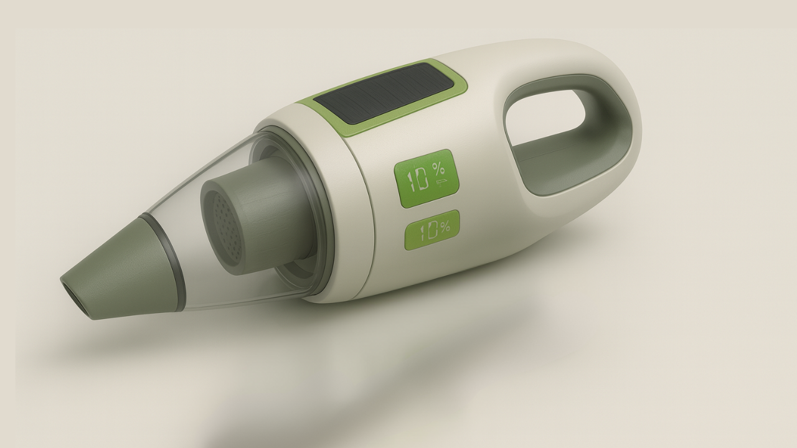
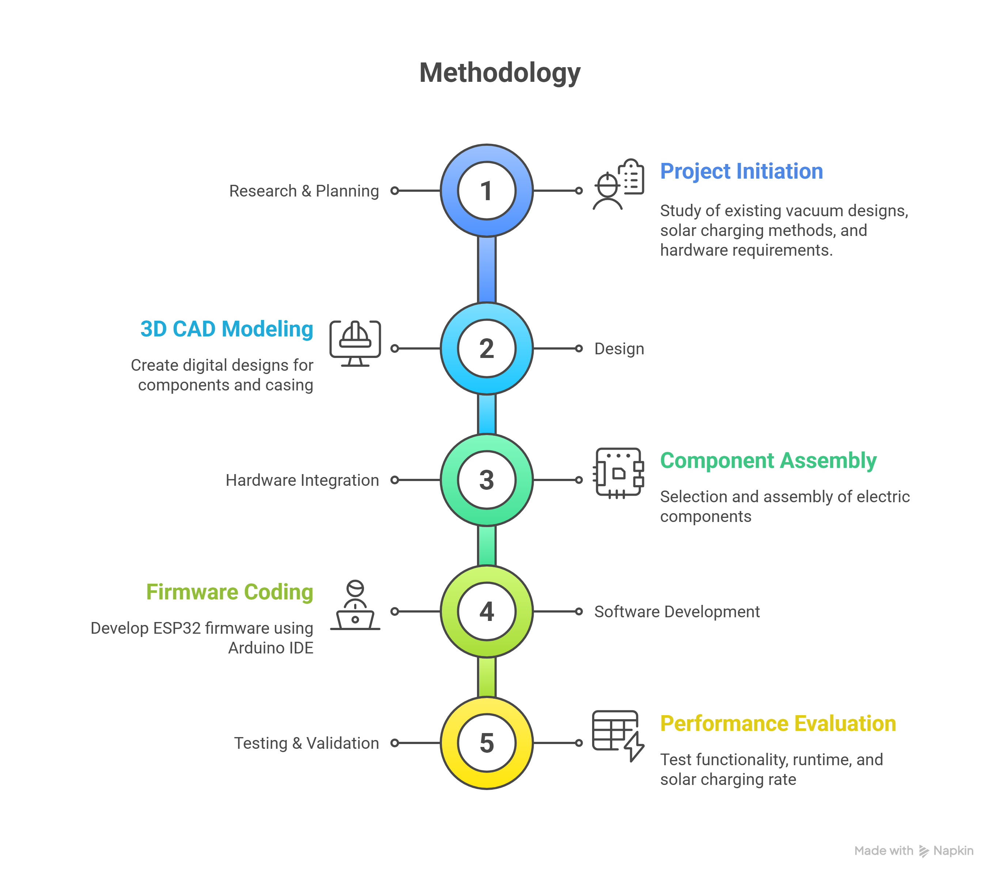
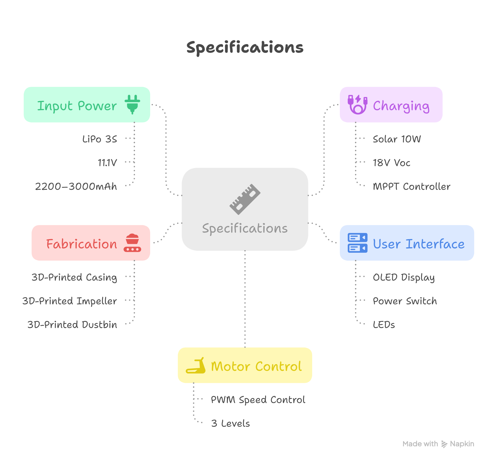

# 🌱 GreenTech Solar-Powered Portable Vacuum

---

## Project Overview
The prototype is designed to show how small household devices can be reimagined for sustainability.  
Key features include:
- Portable vacuum with 3D-printed casing and dustbin
- Solar charging via built-in 10W photovoltaic panel
- LiPo-powered motor for suction
- Battery monitoring and temperature sensing
- OLED display for system status (battery %, solar charging, fan level)

---

## Methodology

---

## Techniques & Procedures
- 3D Printing (FDM) for casing and impeller
- PWM Motor Control via ESP32 → Motor Driver (MDD10A)
- Solar Energy Harvesting with 10W panel + MPPT charge controller
- Battery Management with LiPo + buck converter (LM2596)
- Data Monitoring: Voltage sensing, DS18B20 temp sensor, OLED display

---

## Bill of Materials (BoM)

---

## Estimated Cost
Approx. RM 400 – RM 600
Most electronics can be purchased from [Cytron Technologies](https://my.cytron.io/).

---

## Specifications

---

## How It Works
1. The LiPo battery powers the DC motor through an MDD10A motor driver.  
2. The ESP32 controls fan speed, monitors battery voltage and temperature, and updates the OLED display.  
3. The solar panel charges the battery via a mini MPPT controller, with LEDs indicating charging status.  
4. The vacuum body and dustbin are 3D-printed, integrating the solar panel on its top surface.

---